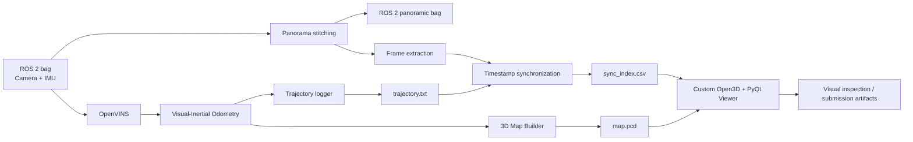
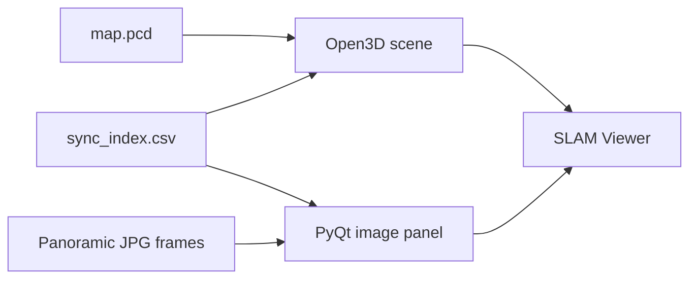

# ROS 2 Visual-Inertial SLAM Pipeline

<p align="center">
  <strong>Automated visual-inertial SLAM pipeline for the Hilti-Trimble SLAM Challenge 2026</strong>
</p>

<p align="center">
  ROS 2 Jazzy · OpenVINS · OpenCV · Open3D · PyQt5 · Docker · C++ · Python
</p>

<p align="center">
  <strong>Challenge score: 94.1 / 100</strong>
</p>

---

## Overview

This project is a fully automated **visual-inertial SLAM pipeline** built for the **Hilti-Trimble SLAM Challenge 2026**.

Starting from raw ROS 2 sensor recordings, the system can automatically:

- preprocess and stitch panoramic camera frames;
- run visual-inertial state estimation with **OpenVINS**;
- reconstruct a 3D point-cloud map;
- record the estimated trajectory;
- synchronize camera frames with 3D poses;
- visualize the map, trajectory and corresponding panoramic image in a custom desktop viewer;
- prepare reproducible outputs inside a Dockerized ROS 2 environment.

The goal was not just to run a SLAM algorithm, but to build a **repeatable end-to-end robotics pipeline** around it.

---

## Result

<p align="center">
  
</p>

The pipeline achieved a **94.1 / 100 challenge evaluation score**.

The screenshot above shows the estimated trajectory over the reconstructed environment during evaluation.

---

## SLAM visualization

The project includes a custom synchronization viewer that connects:

- the reconstructed point cloud;
- the full estimated trajectory;
- the current camera pose;
- the panoramic frame corresponding to that pose.

<p align="center">
  
</p>

The red marker shows the current estimated position inside the point cloud, while the camera image is updated according to the selected trajectory timestamp.

This makes it possible to visually inspect whether geometry, trajectory and camera observations remain synchronized.

---

## Pipeline



The complete workflow is orchestrated by shell scripts, so a dataset run does not require manually starting ROS nodes one by one.

---

## What happens after one command

The main entry point is:

```bash
./start.sh floor_1 2025-05-05 run_1
```

The pipeline then performs the following steps:

```text
Docker image
    ↓
ROS 2 workspace build
    ↓
check input rosbag
    ↓
panorama stitching
    ↓
launch map server
    ↓
launch OpenVINS + map builder + trajectory logger
    ↓
play rosbag
    ↓
save 3D point cloud + trajectory
    ↓
synchronize trajectory and panoramic frames
    ↓
open custom SLAM viewer
```

For a first run, the project automatically builds the Docker image and ROS 2 workspace before processing the dataset.

---

## Visual-inertial SLAM

The core state-estimation component is **OpenVINS**.

Visual observations and IMU measurements are fused to estimate the motion of the sensor rig through the environment.

Conceptually:

```text
Camera frames ─────┐
                   ├── OpenVINS ──> pose / odometry
IMU measurements ──┘
```

The estimated poses then become the common reference for trajectory export, mapping and image synchronization.

Sensor intrinsics, extrinsics and estimator parameters are kept in configuration files instead of being hard-coded into the runtime pipeline.

---

## Panoramic preprocessing

Before visualization, camera observations can be converted into a panoramic stream.

The pipeline automatically checks whether a stitched bag already exists. If not, it runs the panorama stitching stage using the calibrated camera configuration and masks.

```text
raw camera streams
        ↓
camera calibration
        ↓
image masks
        ↓
OpenCV stitching
        ↓
panoramic ROS 2 bag
```

This stage is integrated into `run_pipeline.sh`, so repeated experiments can reuse an already generated panoramic bag instead of recomputing it.

---

## 3D mapping

During rosbag playback, the mapping components produce a point-cloud representation of the environment.

The main artifact is:

```text
data/map_<floor>_<date>_<run>.pcd
```

The point cloud is later loaded by Open3D for inspection.

The pipeline also stores the estimated trajectory separately, which keeps map generation and trajectory analysis decoupled.

---

## Trajectory and image synchronization

A useful SLAM visualization needs more than a point cloud.

The project builds a synchronization index that associates camera frames with estimated positions:

```text
timestamp
image_path
x
y
z
...
```

This index is consumed by the custom viewer.

The result is a timeline where moving the slider changes both:

1. the panoramic image;
2. the position marker inside the reconstructed 3D map.

That makes trajectory errors considerably easier to inspect than by looking at raw pose files alone.

---

## Custom 3D viewer

The repository contains its own `slam_viewer.py` based on **Open3D + PyQt5**.

It provides:

- loading of `.pcd` SLAM maps;
- full trajectory rendering;
- a moving 3D pose marker;
- synchronized panoramic image display;
- timeline navigation using a slider;
- current frame and XYZ position display.



This part is particularly useful for debugging because it connects numerical odometry with what the sensor actually saw at that moment.

---

## Dockerized robotics environment

One of the practical problems with ROS projects is reproducibility.

This project packages the runtime into Docker with:

- **ROS 2 Jazzy Desktop**;
- Ceres;
- Open3D;
- OpenCV;
- pandas;
- EVO;
- PyQt5;
- required X11/Qt dependencies.

The repository also includes host display forwarding for graphical applications such as RViz and the custom viewer.

This allows the same SLAM workflow to run without manually recreating the ROS environment on every machine.

---

## Cross-platform workflow

The launch scripts include GUI configuration for:

- Ubuntu / X11;
- Windows 11;
- WSL2;
- Docker Desktop / WSLg.

The container mounts the ROS workspace from the host and forwards the display into the container.

That means the heavy robotics environment remains isolated while generated maps, trajectories and images remain directly accessible from the host filesystem.

---

## Output artifacts

After a successful run, the pipeline generates reusable artifacts instead of keeping the result only inside ROS topics.

| Artifact | Purpose |
|---|---|
| `map_*.pcd` | reconstructed 3D point cloud |
| `trajectory_*.txt` | estimated trajectory / odometry |
| `dataset/.../images/` | extracted panoramic camera frames |
| `sync_index.csv` | mapping between frames and trajectory positions |
| stitched rosbag | reusable panoramic sensor stream |

These files can be used independently for visualization, analysis or further computer-vision tasks.

---

## Repository structure

```text
ros2_slam_pipeline/
├── Dockerfile
├── start.sh
├── run_pipeline.sh
├── run_docker.sh
│
└── src/
    └── hilti-trimble-slam-challenge-2026/
        ├── challenge_tools_ros/
        │   ├── bag_helper/
        │   │   └── image_stitching.py
        │   ├── gt_helper/
        │   └── runtime_helper/
        │       ├── map_builder.py
        │       └── map_server.py
        │
        ├── config/
        ├── build_index.py
        └── slam_viewer.py
```

At the repository root, the scripts handle orchestration and environment setup. The ROS package contains dataset tooling, mapping utilities, synchronization logic and visualization.

---

## Quick start

### Requirements

- Docker
- Git
- Ubuntu with X11, or Windows 11 with WSL2 + Docker Desktop

Clone the repository:

```bash
git clone https://github.com/Povasin/ros2_slam_pipeline.git
cd ros2_slam_pipeline
```

Place the dataset in the expected directory structure:

```text
data/
└── floor_1/
    └── 2025-05-05/
        └── run_1/
            └── rosbag/
                └── rosbag.db3
```

Run:

```bash
chmod +x start.sh run_pipeline.sh

./start.sh floor_1 2025-05-05 run_1
```

On the first launch the Docker image and ROS 2 workspace are built automatically.

---

## Configuration

SLAM and sensor parameters are separated from orchestration code.

Typical configuration points include:

```text
src/openvins_config/params/estimator_config.yaml
src/openvins_config/params/sensor_calibration.yaml
```

Camera/IMU intrinsics and extrinsics can therefore be adapted for another sensor rig without rewriting the core orchestration pipeline.

---

## Technology stack

| Area | Technology |
|---|---|
| Robotics middleware | ROS 2 Jazzy |
| Visual-inertial SLAM | OpenVINS |
| Image processing | OpenCV |
| 3D processing | Open3D |
| Desktop UI | PyQt5 |
| Optimization | Ceres |
| Trajectory evaluation tooling | EVO |
| Languages | Python, C++17, Bash |
| Environment | Docker |

---

## Why this project is more than a SLAM demo

The main engineering value is the integration around the estimator.

A raw SLAM algorithm is only one component. A usable robotics workflow also needs:

```text
sensor data
   ↓
calibration
   ↓
preprocessing
   ↓
state estimation
   ↓
mapping
   ↓
data synchronization
   ↓
visual validation
   ↓
reproducible execution
```

This project implements that surrounding infrastructure.

Key engineering decisions include:

- Dockerizing the complete ROS 2 environment;
- making the processing pipeline runnable through one entry point;
- automatically reusing preprocessed panoramic data;
- exporting standard artifacts instead of depending on live ROS topics;
- synchronizing images and poses for debugging;
- building a dedicated viewer around the generated map;
- keeping estimator and sensor configuration external to the orchestration code.

---

## Project highlights

| | |
|---|---|
| **Challenge result** | **94.1 / 100** |
| **SLAM** | Visual-Inertial, OpenVINS |
| **Middleware** | ROS 2 Jazzy |
| **Mapping output** | PCD point cloud |
| **Visualization** | Custom Open3D + PyQt5 viewer |
| **Preprocessing** | Panoramic image stitching |
| **Reproducibility** | Dockerized workflow |
| **Automation** | One-command end-to-end processing |

---

<p align="center">
  <strong>ROS 2 Visual-Inertial SLAM Pipeline</strong><br>
  Raw sensor recordings → visual-inertial odometry → 3D map → synchronized visualization.
</p>
